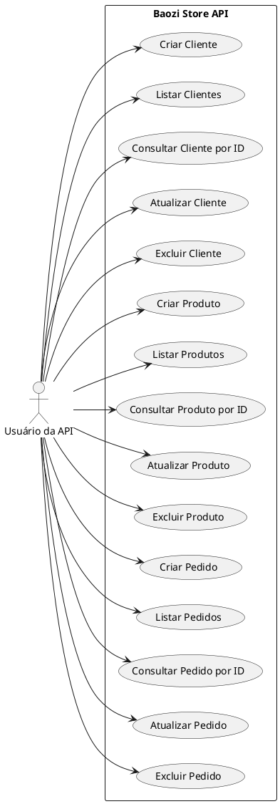

# Diagrama de Caso de Uso - Baozi Store

Você pode reproduzir este diagrama em uma ferramenta UML como draw.io, Lucidchart ou PlantUML.

```plantuml
@startuml
left to right direction

actor "Usuário da API" as Usuario

rectangle "Baozi Store API" {
    usecase "Criar Cliente" as UC1
    usecase "Listar Clientes" as UC2
    usecase "Consultar Cliente por ID" as UC3
    usecase "Atualizar Cliente" as UC4
    usecase "Excluir Cliente" as UC5

    usecase "Criar Produto" as UC6
    usecase "Listar Produtos" as UC7
    usecase "Consultar Produto por ID" as UC8
    usecase "Atualizar Produto" as UC9
    usecase "Excluir Produto" as UC10

    usecase "Criar Pedido" as UC11
    usecase "Listar Pedidos" as UC12
    usecase "Consultar Pedido por ID" as UC13
    usecase "Atualizar Pedido" as UC14
    usecase "Excluir Pedido" as UC15
}

Usuario --> UC1
Usuario --> UC2
Usuario --> UC3
Usuario --> UC4
Usuario --> UC5

Usuario --> UC6
Usuario --> UC7
Usuario --> UC8
Usuario --> UC9
Usuario --> UC10

Usuario --> UC11
Usuario --> UC12
Usuario --> UC13
Usuario --> UC14
Usuario --> UC15
@enduml
```
